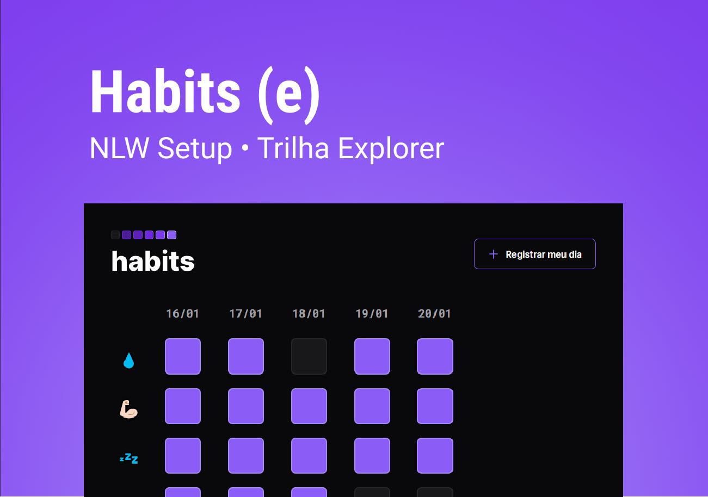

<h1 align="center"> Habits </h1>

  App desenvolvido durante a NLW Setup com o objetivo de estudos de html, css e JavaScript    

  <a href="#-tecnologias">Tecnologia</a>&nbsp;&nbsp;|&nbsp;&nbsp;
  <a href="#-projeto">Projeto</a>

 

  

## 👨🏻‍💻 Tecnologias

Tecnologias utilizadas:

- HTML e CSS
- JavaScript
- Git e Github
- Figma

## 💻 Projeto

Aplicativo web desenvolvido durante o evento NLW Setup da Rocketseat, com o objetivo de aprimorar conhecimentos em HTML, CSS e JavaScript. O app permite o acompanhamento de hábitos saudáveis, como ler livros, beber água, praticar exercícios, meditar e manter uma alimentação equilibrada. Ele funciona como um checklist diário, onde o usuário pode registrar suas atividades e acompanhar seu progresso ao longo do tempo.

- Link do projeto online -> (https://Rinacimar.github.io/nlw-setup-habits)
